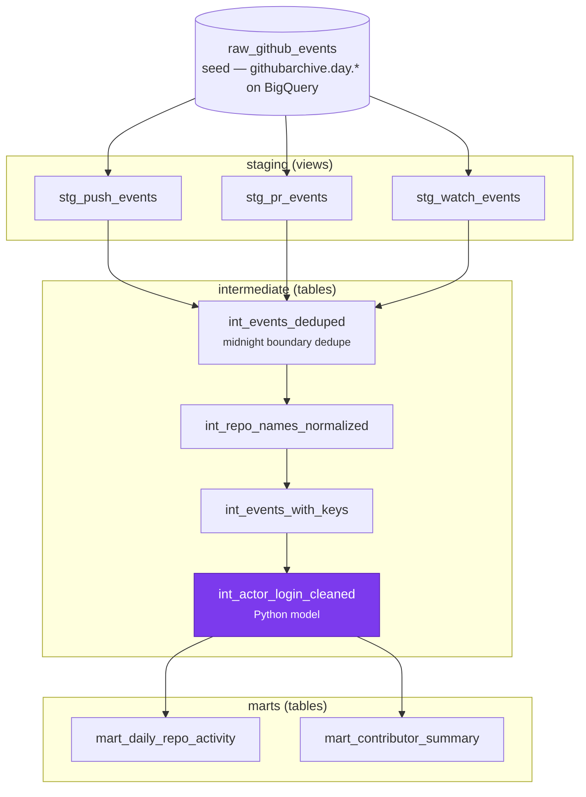

# dbt-github-insights

A dbt project that turns **GitHub Archive** event data into clean, tested analytics tables: daily repo activity and contributor summaries. Built as a portfolio piece showing layered SQL modeling, data quality gates, and a path from local dev to BigQuery at scale.

## Why it matters

The public GitHub Archive is **multi-terabyte**; most tutorials never touch real scale. This repo shows how to **scope sensibly** (days/months, not the full history), model event types separately in staging, dedupe midnight boundary duplicates, classify bot actors, and enforce **probabilistic** quality tests (`mostly`-style thresholds). It runs **locally on DuckDB** today — including a real dbt **Python model** — and the models are dual-target, so enabling **BigQuery** is a target flag rather than a rewrite.

## Architecture



`int_actor_login_cleaned` is a **dbt Python model** (highlighted above), executed
in-process by dbt-duckdb locally. Everything else is SQL.

For the interactive version with column-level docs and test coverage:

```powershell
dbt docs generate
dbt docs serve
```

## Data profile (local seed)

From [docs/exploration.md](docs/exploration.md):

| Metric | Value |
|--------|-------|
| Raw rows | 21 (20 unique events after dedup) |
| Event mix | 76% Push, 10% PR, 14% Watch |
| Automated actors | 3 bot + 4 CI-vendor (patterns overlap); 4 of 20 deduped events excluded from `human_events` |
| Invalid repo slugs | 1 (5%) |
| Date span | 2024-01-01 → 2024-01-03 |

Designed to scale to **3–6 months** of `githubarchive.day.*` partitions. The
layer boundaries, tests and marts carry over unchanged; the staging model bodies
are rewritten against the BigQuery schema (see below).

## Run it yourself — locally, no account needed

Everything below runs on your machine against a 21-row seed. No GCP project, no
billing, no service account key, no network calls after `dbt deps`. It takes
about two minutes.

```powershell
git clone https://github.com/clyv/dbt-github-insights.git
cd dbt-github-insights

py -3 -m venv .venv
.\.venv\Scripts\Activate.ps1
pip install -r requirements.txt

$env:DBT_PROFILES_DIR = (Get-Location).Path
copy profiles.yml.example profiles.yml
mkdir data                               # DuckDB will not create the parent dir

dbt deps
dbt build                                # seed + run + test, in dependency order
```

You should see exactly this:

```
Finished running 1 seed, 6 table models, 48 data tests, 3 view models
Completed successfully
Done. PASS=58 WARN=0 ERROR=0 SKIP=0 NO-OP=0 REUSED=0 TOTAL=58
```

If you get anything else, that is a bug in this repo — please open an issue.

Look at what you just built:

```powershell
dbt show --select mart_daily_repo_activity --limit 10
dbt show --select mart_contributor_summary --limit 10
```

```
| event_date | repo_owner  | repo_slug | total_events | human_events | total_commits |
| ---------- | ----------- | --------- | ------------ | ------------ | ------------- |
| 2024-01-01 | acme        | widget    |            4 |            2 |             7 |
| 2024-01-02 | open-source | lib       |            3 |            3 |            11 |
```

`total_events` 4 vs `human_events` 2 on `acme/widget` is the bot and CI
filtering doing its job — a `dependabot[bot]` push and a `travis-ci` push.

The rest of the tooling, none of which needs an account:

```powershell
dbt docs generate
dbt docs serve                            # interactive DAG, column docs, test coverage
python scripts/validate_bigquery_sql.py   # parses every BigQuery branch
python scripts/check_lineage_diagram.py   # asserts the README DAG matches the manifest
```

## Test strategy

Two classes of assertion, applied deliberately — strict where the data has no
excuse, probabilistic where a real event stream legitimately has noise.

**Strict** — a violation is a bug:

- `not_null` + numeric regex on `event_id` (all three staging models)
- `not_null` + `2020-01-01 → 2030-12-31` range on `occurred_at`
- `unique` on `event_id` in `int_events_deduped` — see below
- `unique` on `surrogate_key` in `int_events_with_keys`
- `accepted_values` on `event_type`, and on `watch_action` (GitHub only ever
  emits `started` for WatchEvent)
- Grain assertions on both marts

**Probabilistic** — a violation below threshold is expected noise:

| Test | Column | Threshold |
|------|--------|-----------|
| `mostly_not_null` | `stg_*_events.actor_login` | ≥ 98% |
| `mostly_between(1, 5000)` | `stg_push_events.push_commit_count` | ≥ 99.5% |
| `mostly_not_null` | `int_actor_login_cleaned.actor_login_clean` | ≥ 98% |

These are custom generic tests in `macros/` (see design decisions below), so
they are applied in YAML like any other test rather than copy-pasted as
singular SQL per column.

The thresholds encode **production intent** for real `githubarchive.day.*`
partitions, where deleted accounts leave `actor_login` null and force-pushes
produce genuine `push_commit_count` outliers. The local seed is clean, so these
currently pass at 100% — they are guardrails for the cloud swap, not
demonstrations of tolerated local failures.

**Volume:** table row count bounds on every staging model (relaxed for the local
seed; raise `stg_push_events` min to ~10,000 for BigQuery partitions).

### Why `unique` on `event_id` is not in staging

The seed deliberately contains event `1001` twice, one second apart — the
midnight boundary duplicate that adjacent `githubarchive.day.*` partitions
really do produce. Staging preserves the raw stream as-is, so `event_id` is
**not** unique there. `int_events_deduped` is the first model where it is, so
that is where the assertion lives. A `unique` test in staging would have been
asserting that the problem this pipeline exists to solve does not occur.

## Key design decisions

| Decision | Why |
|----------|-----|
| **DuckDB + seed first** | Full DAG and tests without GCP billing, keys, or network during development. |
| **Custom `mostly_*` generic tests** | `dbt_expectations` has no `mostly:` argument — it was never ported from Great Expectations, so `mostly:` fails with `takes no keyword argument 'mostly'` on any version. Rather than write one singular test per column, `macros/test_mostly_not_null.sql` and `macros/test_mostly_between.sql` recover the ergonomics as reusable generic tests. Both use portable SQL (no `FILTER` clause) so they run unchanged on DuckDB and BigQuery. |
| **Uniqueness asserted after dedupe** | Raw GitHub Archive partitions contain midnight boundary duplicates by design, so `unique` on `event_id` belongs on `int_events_deduped`, not staging. |
| **Actor cleaning as a Python model** | The bot and CI-vendor rules are a maintained list, not a fixed expression — in SQL every addition edits a regex literal inside a CASE. dbt-duckdb runs Python models in-process, so this is real and tested locally, not aspirational. It is the only Python in the DAG. |
| **Dual-target models, not doc snippets** | Staging and `int_repo_names_normalized` branch on `target.type`, so enabling cloud is `--target bigquery` rather than hand-copying SQL out of a markdown file and hoping it still matches. |
| **Intermediate as tables, staging as views** | Cheap fresh staging; materialize heavier transforms once. |
| **One staging model per event type** | Clear lineage and simpler downstream joins. |
| **Repo name `dbt-github-insights`** | Public portfolio repo (plan suggested `dbt-github-archive`; same purpose). |

## Project layout

```
models/
  sources.yml    local_github (seed) + githubarchive (BigQuery)
  staging/       stg_*_events.sql + .yml  -- dual-target
  intermediate/  int_*.sql + int_actor_login_cleaned.py  -- Python model
  marts/         mart_*.sql + _marts.yml
macros/          mostly_not_null + mostly_between generic tests
scripts/         validate_bigquery_sql.py, check_lineage_diagram.py
seeds/           raw_github_events.csv
docs/            exploration.md, PHASE_STATUS.md, bigquery_staging_snippets.md
```

## Phase checklist

See [docs/PHASE_STATUS.md](docs/PHASE_STATUS.md) for per-phase completion.

- [x] Phase 1 profile (local seed)
- [x] Phases 2–4, 6–7, 9
- [x] Phase 5 Python model (`int_actor_login_cleaned.py`, green locally)
- [x] Phase 8 lineage (Mermaid DAG above, generated from the manifest)
- [ ] Phase 0 GCP account — **deliberately left to you.** Every part of the cloud
      path that can be built without an account is done and dialect-validated;
      what remains is creating *your own* GCP project, enabling billing and
      downloading a service account key. That is not something this repo can
      ship, and not something you should accept from anyone else.
      → [Steps](#run-it-against-the-real-archive--your-own-gcp-account) · [docs/PHASE_STATUS.md](docs/PHASE_STATUS.md)

## Run it against the real archive — your own GCP account

The local path above proves the pipeline works. This path points it at the
actual `githubarchive.day.*` tables, which is where it gets expensive and where
you need your own account.

**Why you have to do this part yourself:** it means creating a Google Cloud
project, attaching a billing account and downloading a service account key.
Those are your credentials and your bill. No repo should ship them, and you
should be suspicious of any that offers to.

### 1. Set up GCP (one time, manual)

1. Create a GCP project and enable the **BigQuery API**
2. Create a service account and grant it **BigQuery Job User** + **BigQuery Data Viewer**
3. Download the JSON key somewhere outside this repo
4. Set the environment variables listed in [`.env.example`](.env.example):
   `GCP_PROJECT_ID` and `GCP_SERVICE_ACCOUNT_KEY_PATH`

### 2. Point dbt at it

```powershell
pip install dbt-bigquery
# merge the `bigquery` target from profiles.yml.bigquery.example into profiles.yml
```

### 3. Run it — pinned to a single day

```powershell
dbt build --target bigquery --vars '{partition_date: "20240101"}'
```

No model bodies change. Staging and `int_repo_names_normalized` branch on
`target.type`, so the same DAG that ran on DuckDB runs on BigQuery.

**Start pinned to one day and check the bytes billed before widening.**
`githubarchive.day.*` is billed per byte scanned, and a wildcard across the full
history is a multi-terabyte scan. The source is deliberately pinned to a single
partition via that var so an accidental full scan takes real effort.

### What to expect the first time

Being straight with you: **none of the BigQuery path has ever been executed.**
There is no GCP project behind this repo. Every BigQuery branch is parsed
against the BigQuery dialect —

```powershell
python scripts/validate_bigquery_sql.py
# 8 model(s) parse as valid BigQuery SQL.
```

— and that catches syntax and dialect mistakes, but parsing is not running. A
column name that does not exist in `githubarchive.day.*` would pass that check
and fail on the real table. Treat your first run as the actual test.

Two things will need adjusting when you do:

- **The row count floor.** `stg_push_events` asserts at least 5 rows, tuned for
  a 21-row seed. Raise it to ~10,000 for real partitions.
- **The Python model.** `int_actor_login_cleaned.py` needs Dataproc Serverless,
  not just BigQuery — a subnet with Private Google Access and
  `roles/dataproc.worker` on the service account. If you would rather not
  provision that, the SQL equivalent is in
  [`docs/bigquery_staging_snippets.md`](docs/bigquery_staging_snippets.md).

If you get it running, the numbers in the **Data profile** table above are the
ones to replace with real partition stats.

## License

Portfolio project. GitHub Archive data subject to [GitHub Terms of Service](https://docs.github.com/en/site-policy/github-terms/github-terms-of-service).
